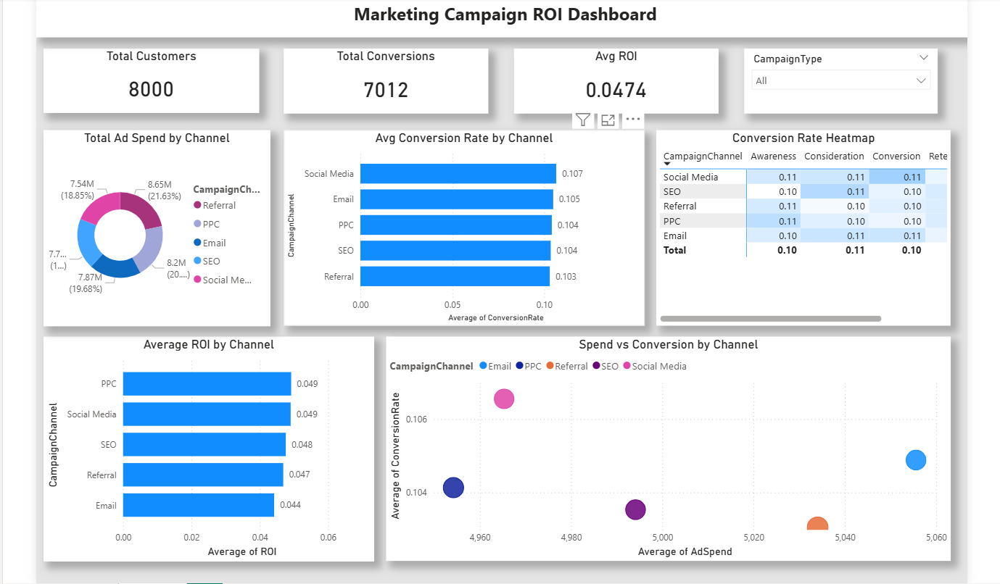
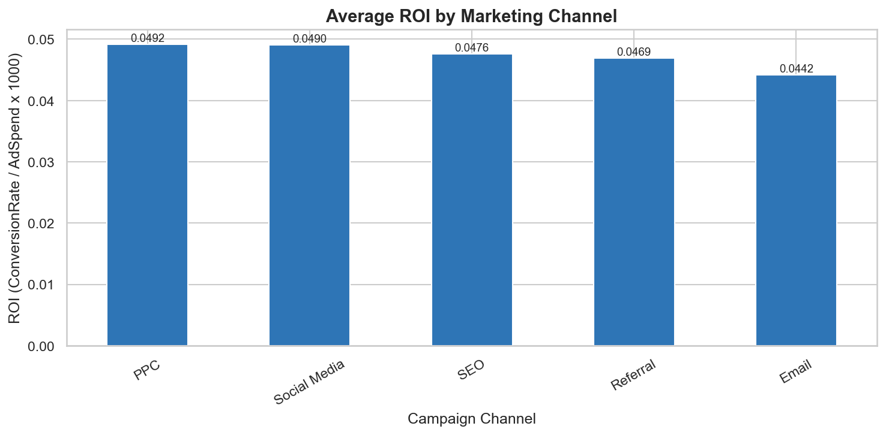
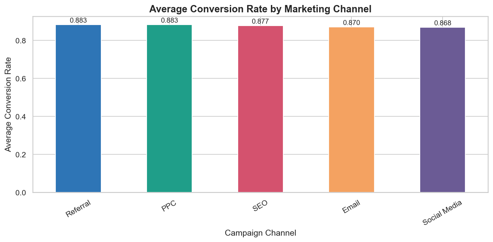
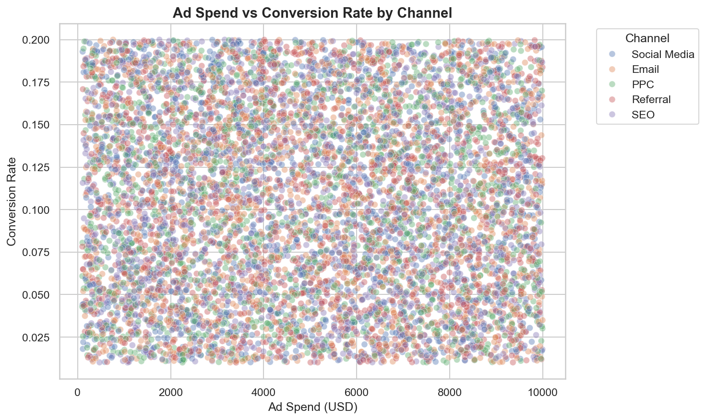

# 📊 Marketing Campaign Analysis Project  

---

##  About the Project  
In this project, I analyzed a digital marketing dataset to understand how different marketing channels perform. The goal was to identify which channels are more effective and how return on investment (ROI) can be improved through better decision-making.

---

##  Tools Used  
- Python (Pandas, Matplotlib, Seaborn)  
- Jupyter Notebook  
- Power BI  

---

##  Key Insights  
While exploring the dataset, a few important insights stood out:

- Social Media campaigns showed strong conversion performance  
- PPC campaigns delivered the highest ROI, making them the most efficient  
- Email marketing generated conversions but had lower ROI  
- Increasing ad spend did not always improve results (diminishing returns)  
- Higher-income customers were more likely to convert  

---

##  Visual Insights  

### ROI by Channel  

.png)

### Conversion by Channel  

)

### Spend vs Conversion  

---

##  Power BI Dashboard  
To better visualize the data, an interactive dashboard was created in Power BI:

---

##  Project Files  
- `marketing_analysis.ipynb` → Complete analysis in Python  
- `cleaned_marketing_data.csv` → Processed dataset  
- `channel_summary.csv` → Aggregated insights  
- `skillcraft_task4.pbix` → Power BI dashboard  
- `Skillcraft task4 report.pdf` → Final report  

---

##  Final Thoughts  
This project shows that focusing on ROI rather than just conversions leads to better marketing decisions. By investing in the right channels and optimizing underperforming ones, overall performance can be improved.

---

##  Author  
**Swathi M K**  
Data Analyst Intern – SkillCraft Technology  
